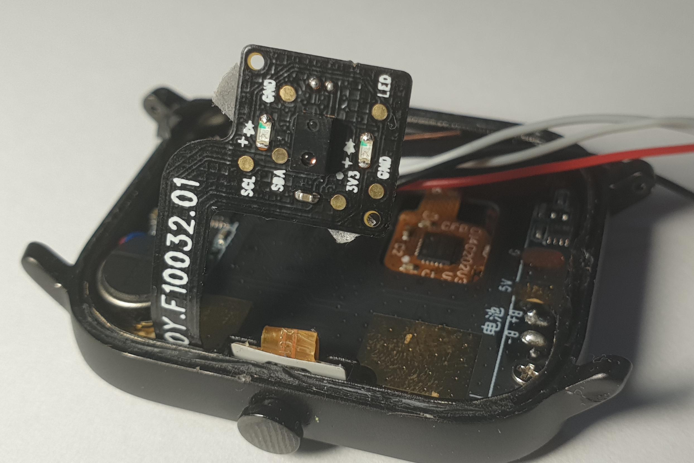

.. ATCWatch docs documentation master file, created by
   sphinx-quickstart on Tue Jun  2 21:01:25 2020.
   You can adapt this file completely to your liking, but it should at least
   contain the root `toctree` directive.

HRS 3300
^^^^^^^^

It's a heart-rate sensor that allows to measure usage of O2, pulse and blood preasure. 

TODO::

    more later
    Blood preasure 
    link to ATC's video about this HRS on his YT

