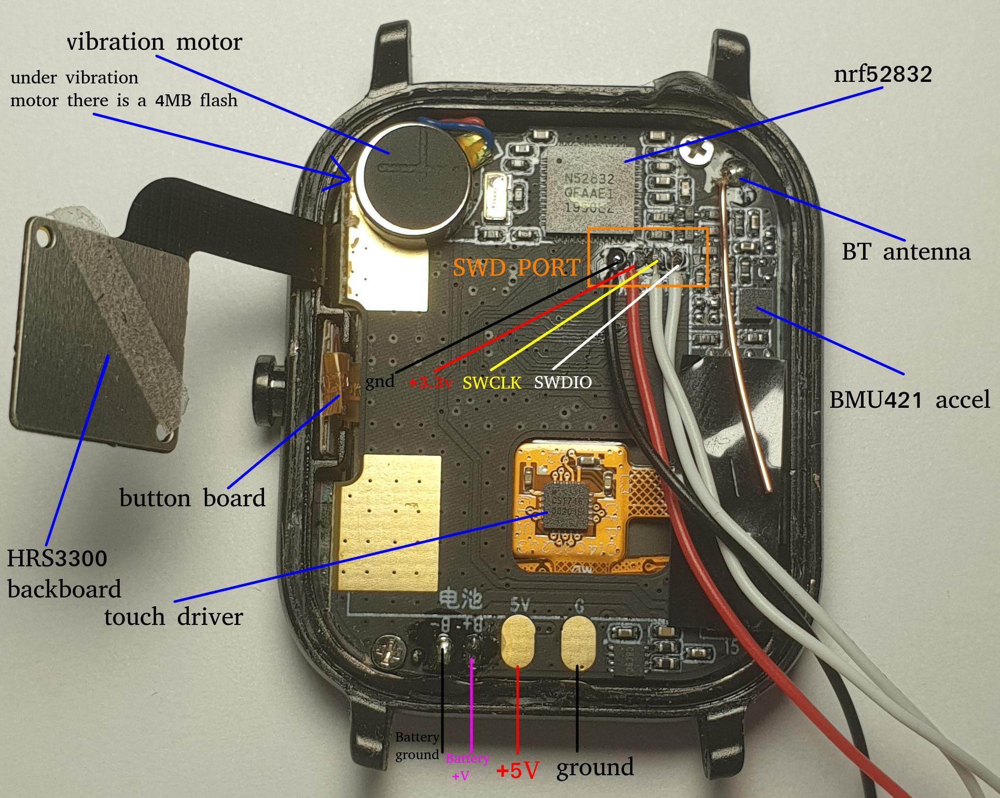

.. ATCWatch docs documentation master file, created by
   sphinx-quickstart on Tue Jun  2 21:01:25 2020.
   You can adapt this file completely to your liking, but it should at least
   contain the root `toctree` directive.

Hardware overview
^^^^^^^^^^^^^^^^^

Board:

|
|

available programmers:

.. image:: files/stlinkv2.jpg
   :width: 49%

Both can be hooked up via SWD to flash the watch via Arduino

TODO::

    connection guide / schematic

